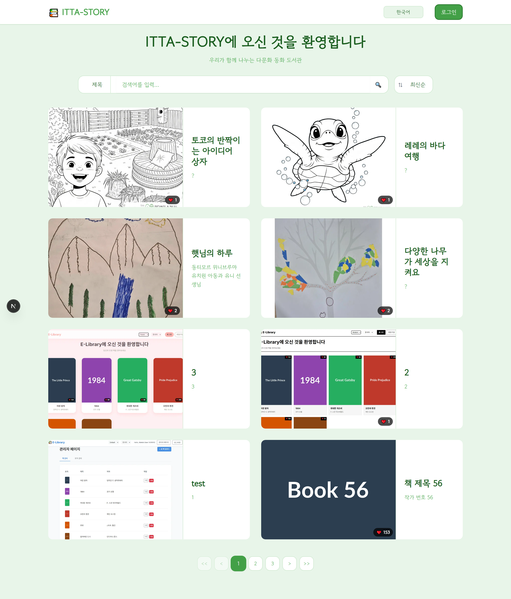

# ITTA-STORY (📖 다문화 가정 아동 동화 도서관)

현대적인 UI/UX를 갖춘 다국어(한국어/영어 및 커스텀 언어) 지원 아동 동화 도서관입니다. Next.js와 Supabase를 기반으로 제작되어, 다문화 가정의 아이들과 부모님이 함께 손쉽게 다양한 언어로 된 그림책과 이야기를 읽고 소통할 수 있도록 돕습니다.

## 🚀 주요 기능 (Key Features)

### 1. 양방향 독서 뷰어 (Interactive Book Reader)
- **실제 동화책 같은 경험**: 데스크탑에서는 양면이 펼쳐진 동화책 구조와 부드러운 화면 전환 효과(Fade-in), 겹친 페이지 그림자(Box-shadow) 효과로 아이들의 몰입감을 높였습니다.
- **이어보기 지원**: 아이가 책을 중간쯤 읽고 나가더라도, 다시 들어왔을 때 **마지막으로 읽은 페이지부터 자동 재생(이어보기)** 됩니다.
- **반응형 디자인 (Responsive)**: 모바일 환경에서는 작은 화면 크기에 맞춰 가독성을 최대로 높인 세로형 UI로 자동 최적화됩니다.

### 2. 완벽한 다국어 호환 (Bilingual & Multicultural System)
- **UI 언어 스위칭**: 헤더의 언어 드롭다운을 통해 사이트 전체 인터페이스를 한국어 ↔ 영어로 전환할 수 있습니다.
- **다국어 번역본 동시 제공**: 원본 책 내용 외에도 다른 다문화 아동을 위해 다른 언어(예: 영어, 베트남어, 중국어 등 커스텀 언어 추가 가능) 번역본을 책 업로드 시 함께 등록할 수 있으며, 뷰어 내에서 언어를 즉각적으로 전환하며 읽을 수 있습니다.

### 3. 사용자 커뮤니티 및 큐레이션 (User & Curation)
- **검색 및 정렬**: 메인 페이지에서 제목/저자별 검색은 물론 최신순/과거순/인기순 정렬을 실시간으로 제공합니다.
- **소통 기능**: 마음에 드는 책에 **좋아요(❤️)** 를 누르거나 **댓글(💬)** 을 남겨 다른 독자들과 감상을 나눌 수 있습니다.
- **마이페이지**: 아이의 독서 기록을 한눈에 볼 수 있습니다.
  - 📚 읽고 있는 동화책 (책갈피 자동 연동)
  - ✔ 다 읽은 책 (완독 뱃지 수여 - 성취감 부여)
  - ❤️ 좋아요한 책
  - 💬 내가 작성한 댓글 목록

### 4. 관리자 전용 대시보드 (Admin Tools)
- **책 업로드 및 관리**: 커스텀 언어를 직관적으로 추가/수정(`✏️`)할 수 있으며, 에디터(Rich Text Editor)를 활용하여 글자 색상, 굵기 등을 지정해 화려한 동화책 내용을 직접 제작 및 구성할 수 있습니다. 책 표지와 개별 페이지 삽화(이미지) 업로드 역시 완벽하게 지원합니다.
- **안전한 환경 보호(회원 관리)**: 무분별한 가입을 방지하기 위해 기본적으로 **관리자가 직접 신규 회원을 생성 및 발급**합니다. 또한 아동이 주 사용층인 만큼 불량 사용자가 발생할 경우, 관리자가 타당한 사유를 기재해 즉시 기능 이용을 차단(Block)하여 쾌적하고 안전한 도서관 환경을 보호합니다.

---

## 🛠 기술 스택 (Tech Stack)

### Frontend
- **Framework**: [Next.js (App Router)](https://nextjs.org/)
- **UI Library**: React (Hooks, Context API)
- **Styling**: Tailwind CSS
- **Language**: TypeScript

### Backend & Database (BaaS)
- **Database / Auth / Storage**: [Supabase](https://supabase.com/) (PostgreSQL)
- **Security**: Row Level Security (RLS) & Server-Side Cookies Auth Strategy

## 🛡️ 권한 및 라이선스 (License & Copyright)
- 이 사이트에 등록된 내용 및 창작 동화 콘텐츠는 운영자 및 원저작자에게 그 권리가 있으며, 우클릭 방지 등의 기초적인 보호 장치가 적용되어 있습니다. 무단 복제 및 상업적 배포를 금합니다.
